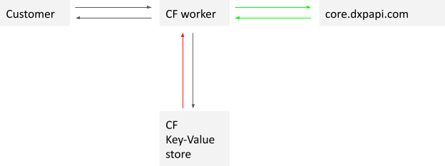

# Failover Caching for Bloomreach Discovery
The core of the Discovery Failover Caching service consists of Cloudflare (CF) workers (serverless functions) that act as a man-in-the-middle between the customer application and Discovery APIs.

During normal operations requests are send to the CF worker, which will send it to Discovery, return response back to user and store request/response in CF’s Key-Value store.

In disaster recovery mode, the CF worker will find a best match, if possible, for the request and return the corresponding response from the Key-Value store for a specified time window. This behaviour is depicted in the diagram below. The green arrow indicates normal operations. The red arrow, retrieving values from the KV store, is only during disaster recovery mode.
   

# Installation Instructions

- Create a business account with Cloudflare or use the existing one if you already have one. An enterprise account will also do, but is not strictly required. The new cloudflare account will be registered via a new domain. ( Lets say example.com )

- Create a DNS entry for example $customer.example.com → SM Origin Endpoint and enable the “Proxied” mode. This subdomain will be used by the customers. Example configuration as following:

- Create 2 new Page Rules for disabling Cloudflare caching (because we will implement our own caching)  for the subdomain and SM origin endpoint. You can see the “Page Rules” tab in the Cloudflare top section.  
Select the Cache Level: Bypass 

- Create a new Cloudflare worker and use the code from the github repository. In “Workers” section, 1 new worker should be created with the code and 1 new routing should be configured for the worker.

- Create 2 new KV storages in Cloudflare. Those KV storages should have following names: brsm_cache and brsm_config 

- These KV storages should be binded to Cloudflare worker as following: (variable names should be as following)

- In the SSL/TLS tab, make sure that SSL is encrypted between Cloudflare and SM Origin. You can check following box (Strict mode):

- If you want to redirect all http requests to https then following configuration can be enabled: SSL/TLS → Edge Certificates

# Configuration

The installation steps above use the brsm_config KV storage for configuration. Please find explanation of each configuration as following:
- **DENY_FQ_PARAMETERS**: This list should include which FQ parameters should be excluded from the cache key. It can be an empty list or it can include multiple parameters, separated by a comma.
   **example value**: department

- **DENY_PARAMETERS**: This is a comma separated list that includes the parameters that should be excluded from the Cache Key.
   **example value**: _br_uid_2,request_id,auth_key,url,ref_url,realm,br_origin,_br_hostname,debug,fl

- **RETENTION_PERIOD_DAYS**: Number of days that cache should be kept in KV Storage. After this period the key is automatically evicted from the cache KV storage.
   **example value**: 7

- **RETURN_RESPONSES_FROM_CACHE**: If it is TRUE then responses are served from the cache otherwise from the SM origin.
   **example value**: TRUE

- **RETURN_CACHES_FROM_DATE**:  From which day cache responses should be returned when the Disaster Recovery (RETURN_RESPONSES_FROM_CACHE) enabled.
   **example value**: 2021-1-25

- **RETURN_CACHES_FROM_ALTERNATIVE_DATE**: If Cache is not found on the first day then we can check alternative date.
   **example value**: 2021-1-27

# Enabling Failover Mode
Failover mode can be enabled in the configuration KV storage. 

Make sure that RETURN_RESPONSES_FROM_CACHE is set ‘TRUE’ and following parameters are configured properly:
- RETURN_CACHES_FROM_DATE
- RETURN_CACHES_FROM_ALTERNATIVE_DATE
